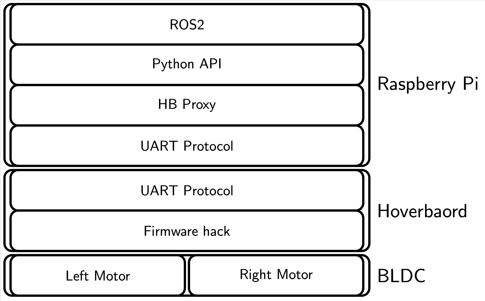

Overview
========

Horo is a project to build a low cost wheeled robotics platform using second hand hoverboards. The hoverboard robot (Horo) is an educational tool to learn about robotics  and the robotic operating system ROS.

TODO: insert picture

Building the platform by using scrap material should cost less than 100 EUR/USD, adding sensors will incur additional costs but these sensors can also be used in other projects.

High Level Architecture
-----------------------

The high level architecture is shown in :numref:hla.

.. _hla:

   High Level Architecture
   
We will modify the firmware on the hoverboard to be able to control the motors from software running on a Raspberry Pi. The communication between the hoverbaord and the Raspberry Pi will be done with a protocol running over UART. We will run a proxy on the Raspberry Pi that will manage the protocol on the UART interface but also allow a Python module to interact with the protocol and thus being capable to controlling the motors and reading the motor encoders.

We will use this Python API in a ROS2 node to abstract the hardware.
   
Key Building Blocks
-------------------

The key building blocks for Horo are as follows:

Hardware:
  The hardware consists of a hoverboard that is physically modified (some pars are cut with a saw), a wooden board or any other material to build a platform, a Raspberry Pi 4B as the main controller and added sensors (see below)
  
Hoverboard Firmware
  We will flash the boards that are shipped with the hoverboard hardware to run customized firmware
  
Hoverboard Interface
  We will run code on the Raspberry Pi that will interface with the hoverboard hardware over UART and provide interfaces to ROS by sending and receiving messages to and from ROS topics
  
ROS
  We will use ROS2 to implement the robots functionality

Sensors
-------

IMU
  We use an inexpensive MPU6050 board

Camera
  The camera will be used for computer vision. Having a neural network processor integrated into the camera will free resources on the main computer. We will test with OAK-D from Luxonis and other non-ai web cams.

Lidar
  A light detection and ranging sensor will be used to scan the environment of the robot. We will test with a relative inexpensive LD06
  
Joystick controller
  To move the robot by hand we will use a PS4 joystick
  
Wheel encoders
  We will use the hal sensor that are part of the BLDC motors of the hoverboard to sensor the wheel movement

Applications
------------

Navigation/SLAM

Line following

Teleop with joystick or keybaord
